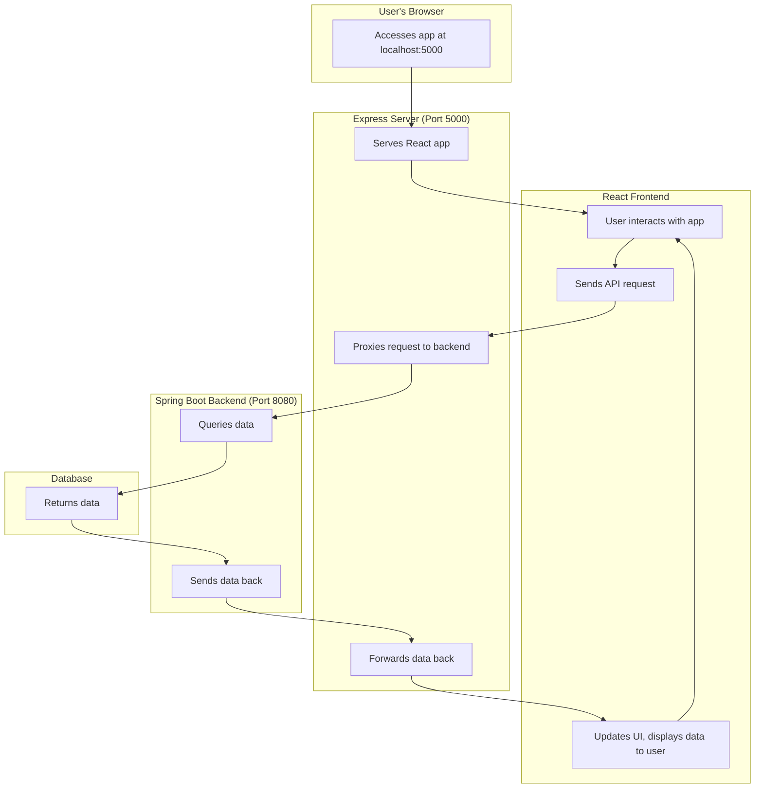
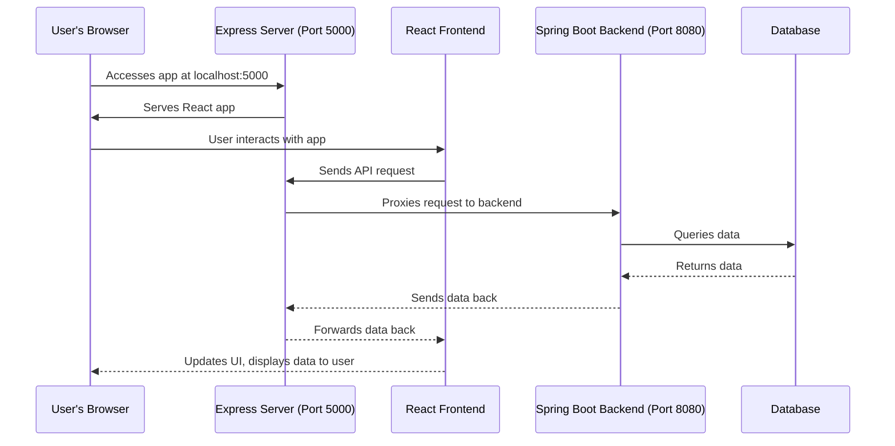

# time-keeper

## Flowchart

```mermaid
flowchart TB
    subgraph "User's Browser"
        access[Accesses app at localhost:5000]
    end
    subgraph "Express Server (Port 5000)"
        serve[Serves React app]
        proxy[Proxies request to backend]
        forward[Forwards data back]
    end
    subgraph "React Frontend"
        interact[User interacts with app]
        send[Sends API request]
        update[Updates UI, displays data to user]
    end
    subgraph "Spring Boot Backend (Port 8080)"
        query[Queries data]
        respond[Sends data back]
    end
    subgraph "Database"
        data[Returns data]
    end

    access --> serve
    serve --> interact
    interact --> send
    send --> proxy
    proxy --> query
    query --> data
    data --> respond
    respond --> forward
    forward --> update
    update --> interact
```

## Sequence Diagram

```mermaid
sequenceDiagram
    participant Browser as User's Browser
    participant Express as Express Server (Port 5000)
    participant Frontend as React Frontend
    participant Backend as Spring Boot Backend (Port 8080)
    participant Database as Database

    Browser->>Express: Accesses app at localhost:5000
    Express->>Browser: Serves React app
    Browser->>Frontend: User interacts with app
    Frontend->>Express: Sends API request
    Express->>Backend: Proxies request to backend
    Backend->>Database: Queries data
    Database-->>Backend: Returns data
    Backend-->>Express: Sends data back
    Express-->>Frontend: Forwards data back
    Frontend-->>Browser: Updates UI, displays data to user

```